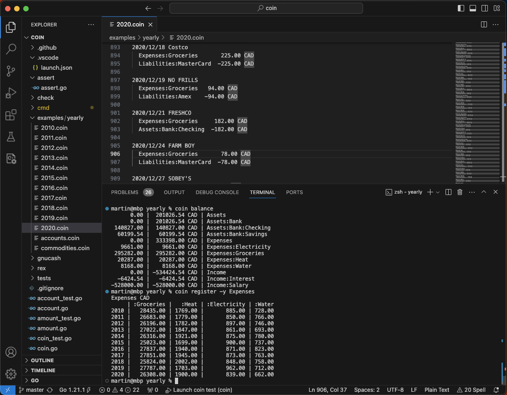

+++
title = 'Plaintext Accounting'
date = 2023-11-25
tags = ["plaintextaccounting", "coin"]
+++

I've been a fan of [plaintext accounting](https://plaintextaccounting.org/) (PTA) ever since I stumbled upon it about a decade ago. I was using [gnucash](https://www.gnucash.org/) back then for some time. While it's a solid and well documented tool, the GUI paradigm just wasn't working well for me. I distinctly remember that cumbersome manual input into the transaction "spreadsheet". In comparison, the flexible plain text input with PTA felt like a breath of fresh air. I could deploy the full power of my text editor (search and replace, autocompletion, snippets, multi-cursor editing, etc). It made the experience much more enjoyable. That is actually quite important because very few look forward to updating their books on a Saturday evening, and if it's annoying you're less likely to stick with it long term.

Another huge benefit of the plain text format is that it enables managing your ledger evolution with the full power of a version control system like git. I learned the hard way to make snapshots of my gnucash database before any substantial changes. But all that gives you is the option to abandon the update and start all over. With PTA and git I can analyze the diff, cherry-pick what's good and fix what is wrong. I can also replicate the ledger repo across several computers and make updates on any of them using workflows that are second nature for any programmer today.

PTA distils double-entry bookkeeping to its absolute essentials. You can keep it simple or you can dial the sophistication to eleven as you gain experience. Combined with excellent documentation of the main tools like [ledger-cli](https://ledger-cli.org/doc/ledger3.html) or [beancount](https://beancount.github.io/docs/index.html) it makes initiation into the world of bookkeeping a breeze. It doesn't have to track just money, you can track time or any other abstract "commodity" you care to do it for.

The way I do things I don't enter transactions from scratch very often. Most of the time I import data from the bank and such, but then I review, tweak and annotate the new entries. Bulk of that work is identifying expense accounts for transactions that weren't classified automatically or correctly. Every now and then I find that some transactions are lost in the import process (do all financial institutions suck at data export or is it just bad luck for me?). Then I have to go and find what's missing in the statements. It's easy and quick to do a monthly update if I do it regularly, at least every 2-3 months. It gets harder the longer I let it slide, as it gets more difficult to remember relevant details few months back.

The third benefit I want to highlight is the openness and flexibility. Vast majority (if not all) of the PTA tools are free and open source. The community has a strong command-line culture which seems to promote straightforward and focused workflows. It also enables creative use in combination with other tools. The data format is simple and clear, it's aimed at human consumption after all. It is also an open invitation to use your data any way you want. Combined with the fact that bookkeeping is a well defined problem with reasonable scope, it just calls for you to try and take a crack at it. I failed to resist the temptation myself (https://github.com/mkobetic/coin). This gives me control over my data and confidence that I'll be able to use it for as long as I want to.

Anyway, if you're trying to keep a handle on your personal finances, I highly recommend giving PTA a good look. If you want more convincing, you can find much more thorough argument [in beancount docs](https://beancount.github.io/docs/command_line_accounting_in_context.html).
