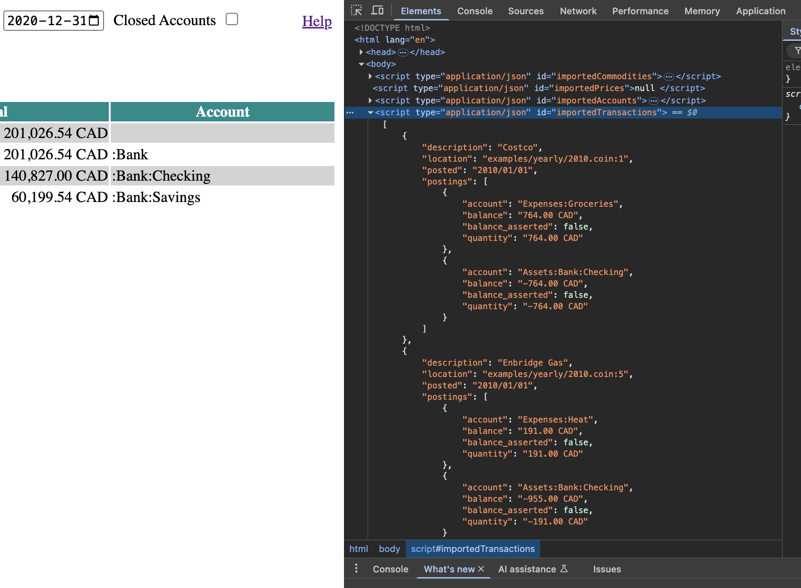

Commandline nature of plaintext accounting (PTA) has a lot of benefits, but it makes the ledger inaccessible for someone who's not inclined to type arcane incantations into the terminal prompt. Moreover it is suboptimal even for those who are, if you want to browse around without a very specific question in mind. An interactive graphical (or textual) viewer is more suitable in these cases. There are [various options](https://plaintextaccounting.org/#ui-web) available for the most common PTA tools, however most require installing something or at least running a server to point a web browser at (e.g. [Fava](https://github.com/beancount/fava)). This is probably unavoidable if you want to allow the tool to modify the ledger, but I was interested in the viewing/browsing function only and wanted something as seamless as possible.

I think the first fully self-contained interactive viewer I ran across was Brendan Gregg's [Flame Graph Viewer](https://www.brendangregg.com/flamegraphs.html). It produces an SVG file that you can open in any web browser and allows interactive navigation around the CPU profile contained within it. The interactivity is provided by a chunk of javascript that is also embedded in the SVG file, hooked up to the various DOM events of the SVG elements. How it works is fairly straightforward but seeing the data bundled with the code providing interactivity into what's nominally considered to be just an "image" file definitely caught my attention.

Recently I've started experimenting with the same approach for an interactive viewer of a PTA ledger. I wrote a fairly simple [utility](https://github.com/mkobetic/coin/blob/master/cmd/coin2html/README.md) that reads the ledger, converts all the data into JSON and bundles it up with all the JS code into a single HTML file. You can see the resulting viewer in action [here](https://mkobetic.github.io/coin/). Browser developer tools can give you a good sense of the overall structure.

It is a fairly bare bones html with barely any styling, partly because I wanted to see what the browsers offer out of the box and partly because I don't know any better. I also like to keep the complexity and dependencies to a minimum. That said I wanted to include charting capability and was intrigued by D3.js for a while, so D3 is the hammer I'm using for all the nails. 

There's a lot of [room for improvement](https://github.com/mkobetic/coin/blob/master/TODO.md#coin2html), both in terms of design/convenience and capability. However I'm reasonably happy with how it's shaping up and I have yet to hit any obstacle in terms of being able to do what I want. I am definitely duplicating parts of the `register` and `balance` commands, but with slightly different twist and aim, so I think that is OK. There are still many things that only the command-line will do and that I don't intend to bring over. The way I look at it is that different use-cases call for different type of interface.

Regardless of the particulars of my little experiment the thing I want to emphasize is the convenience of the self-contained HTML file. I started committing it along with the rest of the ledger, so the viewer is always available with the data that it came from. I just regenerate it when I make updates. A file URL in browser bookmarks makes it always just a click away. No need to start a server or to keep one running permanently. I'm also contemplating generating viewers for subsets of the ledger, e.g. imagine sharing the current year of your small business books with your accountant. All that's needed to use it is a web browser, nothing to install, you don't even need internet, it would be frictionless.

There are other applications of this approach that I'm thinking about. I have another hobby project for rendering GPS tracks as SVG images ([GPX](https://github.com/mkobetic/gpx)). I'm also analyzing the track, splitting it into segments and compiling stats about it. Being able to interactively zoom in on particular segments (very much like the flame graphs do) could be quite useful.

