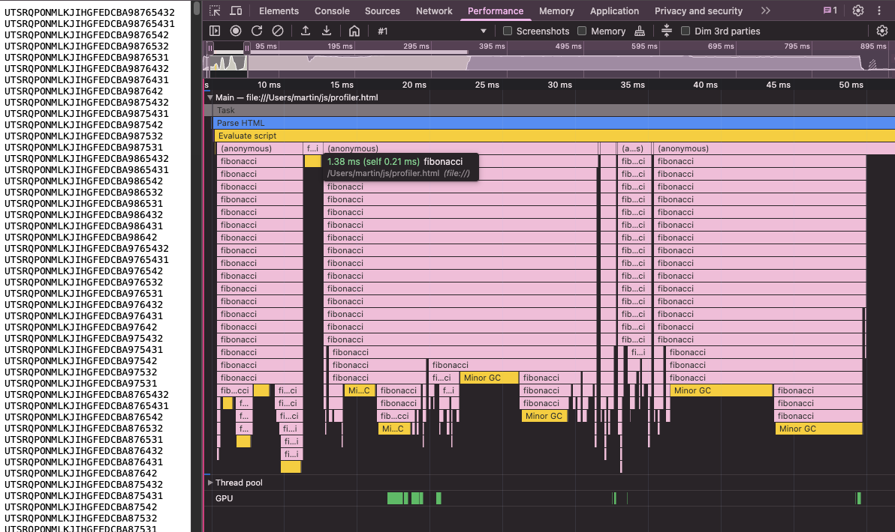

I have spent a fair bit of time in Chrome Dev Tools recently and learned the hard way that you need to be careful with interpreting the [flame graph](https://www.brendangregg.com/flamegraphs.html) that you get when you [record a Performance profile](https://developer.chrome.com/docs/devtools/performance/reference#flame-chart). To illustrate here's a fragment of a flame graph captured from a worker running Typescript's ProjectService used to typecheck source files.


My naive interpretation was: the worker is receiving messages from the main thread over the LSP jsonrpc connection and calling `openClientFile()` in response. Seems pretty clear cut, no? To my astonishment, when I tried to log which files are being open, there was always only single log entry no matter what I tried. I went as far as putting a breakpoint into the openClientFile() function and indeed, hit only once. What is going on?

It seems the spans of the flame graph do not represent the full duration of a given stack frame. In fact it seems a frame can be spread across many spans and it's not a rare occurrence. If that is so, what do the gaps between the spans represent? It turned out to be fairly difficult to find satisfactory answers. The closest I found was an ages old [stack overflow post]( https://stackoverflow.com/questions/46008547/how-to-interpret-gaps-in-chrome-flame-charts). I also ran the same experiment in Firefox dev tools with similar outcome, but at least their [profiler documentation](https://profiler.firefox.com/docs/#/./guide-stack-samples-and-call-trees) provides some explanation how the stack samples collected by the profiler are aggregated to form the flame graph.

The fact that the flame graph is assembled from stack samples collected during the profiler run is not surprising. As such, it is clear that particular stack states that actually happened may be missing if they happen between the moments when samples are taken. So the flame graph can be "simpler" than what actually happened, but that doesn't explain why it would have such a radically different shape in terms of the spans.

As the stack overflow discussion alludes, that presumably happens because of internal implementation details of the JS engines. Apparently when the profiler wakes up to take a sample it may not be possible at that very moment to correctly capture the stack trace (because native code, incomplete frames, mumble, mumble ...). For some reason the profiler captures some strange sample and then, when it is used to build the flame graph, it results in those strange unexpected gaps. One wonders why aren't such samples simply thrown away. Maybe it's difficult to detect them? Who knows.

So how bad is this? It seems it is quite bad. Here's a simple example that can be used to illustrate.

```
<html>
  <body>
    <p id="result" style="font-family: monospace"></p>
  </body>
  <script>
    function toChar(n) {
      if (n < 10) return String.fromCharCode(48 + n);
      if (n < 35) return String.fromCharCode(55 + n);
      if (n < 60) return String.fromCharCode(62 + n);
      return "?";
    }
    function fibonacci(n, prefix) {
      if (n < 1) return prefix + "\n";
      prefix = prefix + toChar(n);
      if (n <= 2) return prefix + "\n";
      return fibonacci(n - 1, prefix) + fibonacci(n - 2, prefix);
    }
    document.getElementById("result").innerText = fibonacci(30, "");
  </script>
</html>
```

I picked fibonacci because we need to make the engine work a little bit for the bad samples to show up. On my laptop I need to go to something like fibonacci(30) for it to show nicely. Here's what you should see if you reload that html file while recording a profile (zoomed at just the script execution range).



The output of the script is shown on the left, it tries to emulate a "flame graph" like the one shown by the profiler but rotated 90 degrees left. Each row of the flame graph is column of the output, the top is on the left. A span would be represented by a section of the column with the same letter. The letter indicates what is the `n` in the stack frame of the `fibonacci(n)` call. Here's how the output for `fibonacci(7)` looks like

```
765432
765431
76542
76532
76531
76432
76431
7642
75432
75431
7542
7532
7531
```

You can see the long fib(7) span on the left, the two fib(6) and fib(5) spans to the right of it, etc. 

What the output tries to demonstrate is how the flame graph should roughly look like. A "correct" flame graph should have one span at the top, 2 spans underneath, 4 spans bellow that, etc. Obviously sampled and all that, but there definitely shouldn't be deep gaps all over it the way it shows up in the snapshot above. If you look closer at the hover bubble in the snaphshot, it shows that the frame at the bottom of the big gap to the left of it is a `fibonacci` frame. The outer `(anonymous)` frame which presumably represents the anonymous function that was compiled from the `<script>` tag is gone completely. In more complex situations, like the LSP worker example I started with, you'll see seemingly random functions at the bottom of these gaps, as if the bad samples were just some fragments of the stack.

Again I don't know why the bad samples can't be simply discarded. I think that could help a fair bit even if there are quite a few of those. It will mean fewer samples to work with, but the bad samples do not seem to help from what I'm seeing.

Here's how the same computation looks in Firefox profiler.


That actually looks a fair bit better. No deep gaps all over it, but it illustrates another discrepancy. We know that "proper" flame graph should have 1 fib frame at the top, then 2 under it, 4 under that, 8 under that, etc. But here we see two frames going many layers deep. So it means that frames can be not only split into multiple spans, but also multiple actual frames can be combined into a single span. A recursive stack like the fibonacci is a particularly bad case for this, because all the frame samples point to the same `fibonacci` function. The profiler would have to somehow distinguish frames based on other aspects, like looking at the actual arguments in the stack frame, which would be a lot more effort and overhead. Taking stack snapshot needs to be fast otherwise the profiler overhead could skew the profile too much. This should also be much less of a problem in a normal situation where the stack snapshot would be much more heterogenous with many different function calls at different positions. So merging frames in cases like this seems like a reasonable tradeoff for better profiling fidelity.

Another thing to note in this profile is that the maximum depth of the fibonacci recursion shown is 26. But the maximum depth in reality for fib(30) is 29 (fib(3) calls fib(2) and fib(1) which both return 1, so fib(n) => max depth n-1). So the profile seems to be missing an envelope of frames at the bottom which presumably were so short that they fell through the sampling sieve. This is in line with the "simpler" flame graph expectation due to sampling.

I should note that I had to tweak the script for Firefox, because it struggled with rendering the textual "flame graph" result of the function. At fib(30) the result is over 800k lines long, and the Firefox renderer was choking on it. So I removed the rendering bit and was able to get the profile shown above. Also while the Firefox profile looks better than Chrome's, it does suffer from the bad samples issue just to a lesser degree. For what it's worth in my experience the gaps seem to be often associated with GC spans.

In conclusion, keep the bad sample issue in mind when you're looking at the Performance flame graph from your browser's Dev Tools. It can easily fool you! 