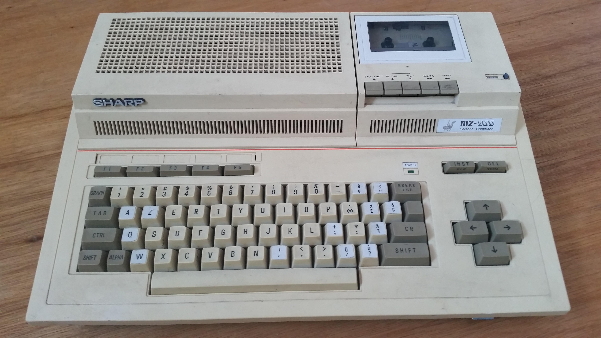

I wanted to dip my toes in embedded programming for a while. Big part of it is nostalgia.
The 8-bit MCUs are very much like the 8-bit microcomputers that I started on. It's even better with the plethora of I/O options they provide. The appeal is that the overall complexity is manageable, you can really understand everything that's going on in the device down to the hardware bits. And you don't need layers of software to make some LEDs blink or to read some sensors.

However even though I've got a few MCU boards gathering dust, I never got around to giving it a serious try, until recently. Somehow I ran across [this post from Eli Bendersky](https://eli.thegreenplace.net/2025/implementing-forth-in-go-and-c/) where he talks about implementing Forth. It piqued my interest because I used Forth long time ago on the first computer I ever had, a Sharp MZ-800.

 As many of the microcomputers of that era it booted into Basic and you loaded other software from cassette tapes (that thing on top right is cassette player/recorder). If you were at all curious you quickly got bored of Basic and started playing with assembler. Somehow I got my hands on an implementation of Forth and I used it to drive this DIY pen-plotter built from a kit based on a Russian kid's constructor set that was popular in my neck of the woods then. It was just a simple metal frame with a roller moving the sheet of paper up and down and a head holding a Sharpie moving along a rod left and right. One step motor driving each of those plus a mechanism that can lift or lower the pen. All this driven through the wires of a standard parallel port. I don't think there was much in terms of electronics. I can't find any pictures, but the frame style looked something like this:

I sunk many, many hours into that project and had a blast, but I don't think I understood Forth deep enough to appreciate its beautiful simplicity. It was just an interesting language that I used to implement what I needed (mind you there was no internet and documentation was scarce behind the iron curtain, so I probably didn't have much to go by anyway).

Fast-forward few decades and Eli's article and the fantastic references he points to opened my eyes. The threaded interpretive language technique is brilliant in its sophisticated simplicity. It adds structured programming support to plain assembler with minimal overhead, combining both seamlessly. Unsurprisingly many Forths include an assembler for their targets, implemented in Forth of course.

Now, I share Eli's doubts about Forth's suitability for general purpose programming and large complex systems, but it definitely looks like a great fit for simple embedded systems. You can implement a Forth core in [less than 512 bytes](https://compilercrim.es/bootstrap/miniforth/) so it can fit into tiniest 8-bit MCUs with lots of room to spare. Indeed there are a few Forths readily available for 8-bit MCUs; the two that caught my attention are

* https://amforth.sourceforge.net/
* https://flashforth.com/index.html

Both of these demonstrate another really attractive aspect of the language. It's dual interpretation/compilation nature is conventionally baked in, so it naturally provides a REPL style interface to a Forth running on an MCU; usually mediated through whatever serial interface is available. So as soon as you program Forth into the board you can open up a serial monitor and start interacting with it. You can poke around to see what's going on inside, add new "words" (Forth's functions) on the fly and invoke them immediately. You have a powerful and fully interactive system to do your exploration with. Makes one reminisce about the wonderful "objects at your fingertips" feel of Smalltalk.

Contrast that with the usual approach where you write your program on the computer, compile it, write it to the board's flash memory, figure out what's broken, go back to the computer, make changes, compile, write to flash, ... rinse and repeat. Now granted, with a polished platform like Arduino with its powerful libraries a lot of the work is already done for you, you don't really need to know that much to get something done. With Forth you just have the bare metal and basic Forth vocabulary to work with so you need to learn a lot about the MCU to do anything really, but that is the point if you're trying to learn.

A notable exception I ran across is ESP32Forth which gives you the interactive nature of Forth along with all the Arduino goodies. This is because it's written in C and linked with all the Arduino libraries. You kind of get the best of both worlds, but also none of it. You get all the Arduino ease and also the Forth interactiveness. But you are now also separated from the metal by whatever the C-compiler does and whatever bloat comes with it. When I tried it compiled to well over a megabyte although I'm guessing most of it is statically linked libraries. All that said I really don't mean to put ESP32Forth down. It is very well executed, I found its code quite readable, I learned a lot from it. And it was actually the easiest one to get going when I tried (more on that later). At this point it would be my first choice if I wanted to start building embedded projects quickly.

So, Forth is what I'm going to be using at least for next little while in my embedded adventures. I want to write some more specific articles to capture what I learned hopefully for not just my own benefit. A lot of information I find is somewhat dated or incomplete, maybe I can fill some gaps to help others along.

Finally, I did notice that 8-bit MCUs are somewhat past their time, given that 32-bit MCUs are plentiful, orders of magnitude more powerful and just as cheap. So Forth's minimalism is probably less important in terms of saving resources, but I think the interactivity can still be valuable at least in the learning process. There seem to be fewer open-source Forths targeting these platforms. Clearly ESP32Forth is in this camp, supporting Xtensa and RISC-V MCUs; I tried briefly to compile it for the ARM M4 MCU used on the nice new Uno R4 boards, but it would require more time and effort. It would also be an interesting target for a Forth written from scratch. AmForth seems to have some experimental bits for ARM and I like how the project is organized. Lots to play with!

P.S.: If you don't care about embedded stuff, [this little gem](https://github.com/remko/waforth) targets WebAssembly.

# References (that caught my attention)

## Implementing Forth
* the one that sent me down the rabbit hole https://eli.thegreenplace.net/2025/implementing-forth-in-go-and-c/
* very good and thorough overview https://www.bradrodriguez.com/papers/moving1.htm
* x86 Forth in 512 bytes https://compilercrim.es/bootstrap/miniforth/
* this book is excellent [TIL](https://archive.org/details/R.G.LoeligerThreadedInterpretiveLanguagesTheirDesignAndImplementationByteBooks1981)

## About Forth
* bit long and windy but with a lot of historical context https://ratfactor.com/forth/the_programming_language_that_writes_itself.html
(just google Forth to see all the classics)

## Embedded Forth

### Atmel AVR8 MCUs
* https://amforth.sourceforge.net/
* https://flashforth.com/index.html
* flashforth help and examples https://arduino-forth.com/

### ESP32
* https://esp32forth.appspot.com (https://github.com/flagxor/ueforth)

### WebAssembly
* https://github.com/remko/waforth