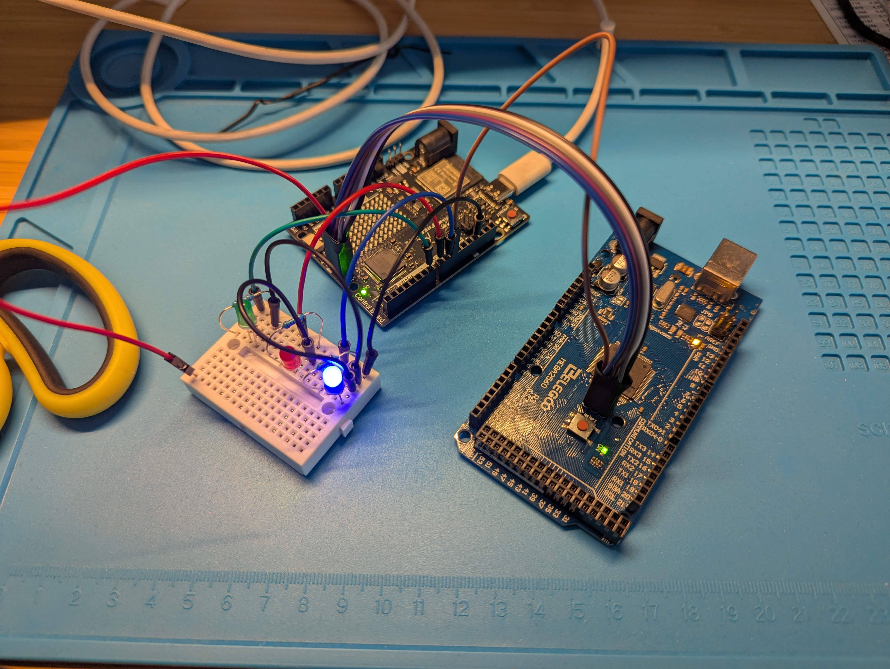

Bootloaders are probably not the first thing one would recommend an embedded programming beginner to dive into, but if you're dead set on running Forth on your board, you'll have to contend with it whether you want to or not. The details discussed below are from Atmel Atmega MCUs (I was using ATmega 2560).

# What is a bootloader

Bootloader is a bit of code that is pre-loaded into the MCUs flash memory and is the first thing that runs when the MCU starts up. In that sense it's no different than any other embedded application but it generally has a specialized purpose and usually coexists side by side with the actual application. On learning/hobby boards like the Arduinos its  purpose is to allow uploading application code into the MCU's flash memory without external programming hardware. These boards usually have a USB port that is connected to one of MCUs serial interfaces (UART). The bootloader watches the interface for communication using a programming protocol. The bootloader of ATmega 2560 uses stk500 protocol. If the protocol is not detected by the bootloader it will let the previously programmed application run.

To program the MCU you simply connect the board to a computer with a standard USB cable. When you somehow create the binary file to write to MCU's flash memory, a tool like avrdude that speaks the programming protocol supported by the bootloader can get it there.

# Bootloader vs MCU programming interface

Initially I misunderstood an important aspect of the whole MCU programming picture. The hobby boards would generally have two MCUs. There would be the main one that the board is for, but there would also be another, smaller one that is hooked up to the USB port.

If you read the MCU datasheet there will be an entire chapter on using the MCU ports and pins to write its flash memory [^1]. So I thought this is what the second MCU was doing when you are programming the board. Kinda like an external MCU programmer that is embedded in the board. However this is NOT what is going on when programming these boards. You wouldn't need a bootloader on the main MCU if this is how things worked. The hardware programming interface allows programming the MCU regardless of what state it is in, e.g. when it is blank after a complete flash memory erasure.

The bootloader, being just a bit of code that the MCU executes, uses different way of writing into the flash, usually through the MCU's special registers. This process would be described in a different chapter of the datasheet [^2], probably in the discussion of the special registers used for this purpose.

So what is the second MCU for? Its purpose is to implement the USB protocol and to relay its payload to the main MCU through a plain UART connection between the two MCUs. That's how the programming protocol bits make it to the bootloader running on the main MCU.

Why is this important? Because it allowed me to understand that I cannot use the bootloader to program Forth into the MCU. To explain this part we need to talk a bit about Forth and flash memory protection in MCUs.

# Bootloader vs Forth

The AVR8 MCUs divide the code memory (flash) into an application section and bootloader section. Only code in the bootloader section can write into the flash memory. Moreover you can disable writing to these sections through "lockbits", a special bit of memory that controls the MCU's flash writing mechanisms. 

To support Forth's ability to add new words interactively, part of its core must reside in the bootloader memory in order to be able to write into the application section where the dictionary resides.

There may be room to fit that bit of Forth side by side with the bootloader, but the board that I was using had the bootloader section locked and the only way to unlock the flash memory is to perform a full chip erasure, which will of course wipe out the bootloader as well. So the only way to write Forth into the MCU is by using an external programmer. It is not possible to do it using the bootloader as is.

# Arduino as ISP

I looked around for an external programmer, but there wasn't much to begin with and whatever there was didn't support the extended memory of ATmega 2560. Fortunately Arduino provides a sketch that allows using another Arduino compatible board as an external programmer, [Arduino as ISP](https://docs.arduino.cc/built-in-examples/arduino-isp/ArduinoISP/). So this became my first actual project, wiring up two boards to program one with the other.

I couldn't resist and got the shiny new Uno R4 board earlier, so I decided to use it as the external programmer for the Mega 2560 board. Initially I was hoping to preserve the bootloader, so at first I just wanted to end up with an unlocked bootloader section. I followed the sketch documentation to do this. The sketch is programmed to also provide LED feedback (heartbeat, activity and error signaling) so I wired that up as well.




The steps were relatively simple (using the Arduino IDE):

1) Uploaded ArduinoISP sketch to Uno R4
2) Hooked up wiring as per the sketch documentation
   * connected ICSP pins except RESET
   * connected Uno R4 pin 10 to ATmega RESET pin
3) Hooked up leds as per sketch info
4) Set Tools>Board to Mega 2560
5) Set Tools>Programmer to "Arduino as ISP" (NOT ArduinoISP !!!)
6) Run Tools>Burn Bootloader

I turned on detailed output and noticed that the "Burn Bootloader" action ran a couple of `avrdude` commands and that the second locked the bootloader section again (`-Ulock:w:0x0F:m`).

```
"/Users/martin/Library/Arduino15/packages/arduino/tools/avrdude/6.3.0-arduino17/bin/avrdude" \
"-C/Users/martin/Library/Arduino15/packages/arduino/tools/avrdude/6.3.0-arduino17/etc/avrdude.conf" \
-v -patmega2560 -cstk500v1 -P/dev/cu.usbmodemB43A45B4700C2 -b19200 \
-e -Ulock:w:0x3F:m -Uefuse:w:0xFD:m -Uhfuse:w:0xD8:m -Ulfuse:w:0xFF:m
...

"/Users/martin/Library/Arduino15/packages/arduino/tools/avrdude/6.3.0-arduino17/bin/avrdude" \
"-C/Users/martin/Library/Arduino15/packages/arduino/tools/avrdude/6.3.0-arduino17/etc/avrdude.conf" \
-v -patmega2560 -cstk500v1 -P/dev/cu.usbmodemB43A45B4700C2 -b19200 \
"-Uflash:w:/Users/martin/Library/Arduino15/packages/arduino/hardware/avr/1.8.6/bootloaders/stk500v2/stk500boot_v2_mega2560.hex:i" 
-Ulock:w:0x0F:m

```

The board ends up in the same situation I started from (which makes sense since the purpose of the sketch is to restore the board to that state). So I reran the commands manually again, this time removing the locking bit (`-Ulock:w:0x0F:m`). Now I finally had a board ready to upload Forth into.

# Enter FlashForth

The upload instructions for FlashForth are straightforward and stipulate external programmer use from the get go. But I was still hoping I could preserve the Arduino bootloader somehow. There seemed to be enough free space in the bootloader section (NRWW) to accommodate the small bit of FlashForth code that needed to reside there. I made sure the bit of code was relocated to addresses in the free space and uploaded the modified version to the board. However the bootloader would not let FlashForth run for some reason that I haven't figured out. Eventually I ran out of patience and uploaded FlashForth blowing the bootloader away, which worked fine. This was also around the time when I decided that I want to move on to 32-bit Forth so I ended up putting FlashForth aside soon after that.

Here are the changes/additions I made while working on this https://github.com/mkobetic/flashforth/compare/master...elegoo-mega2560-r3. The most interesting bits are probably the Makefile showing the commands I was using to work with FlashForth and maybe the ldf utility for loading forth sources into the running FlashForth. A lot of the noise is adjusting the MPLAB X/IDE project for my Mac environment and the 2560 target.

### References

* FlashForth and ATmega MCUs https://flashforth.com/atmega.html
* The Arduino as ISP sketch https://docs.arduino.cc/built-in-examples/arduino-isp/ArduinoISP/
* The Atmega2560 bootloader https://github.com/arduino/ArduinoCore-avr/blob/master/bootloaders/stk500v2
* This has a lot of interesting information about Atmega bootloaders https://www.gammon.com.au/bootloader

[^1]: Chapter 29. Memory Programming in the [ATmega datasheet](https://ww1.microchip.com/downloads/en/devicedoc/atmel-2549-8-bit-avr-microcontroller-atmega640-1280-1281-2560-2561_datasheet.pdf)

[^2]: Chapter 28. Boot Loader Support in the [ATmega datasheet](https://ww1.microchip.com/downloads/en/devicedoc/atmel-2549-8-bit-avr-microcontroller-atmega640-1280-1281-2560-2561_datasheet.pdf)